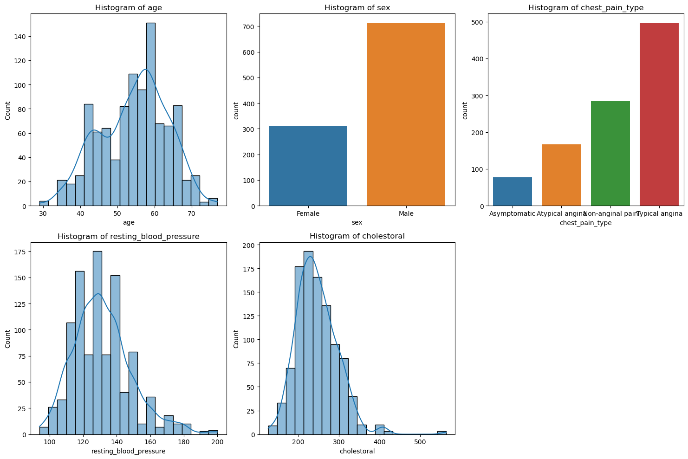
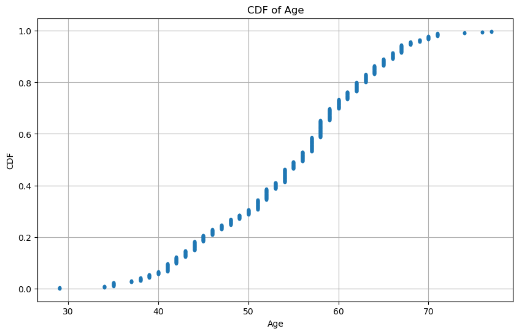
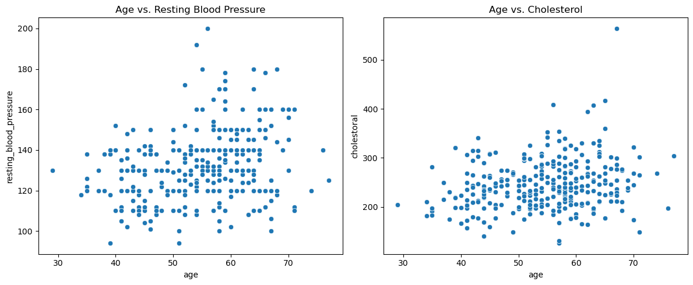

# heart-disease-eda-regression
Exploratory data analysis and regression analysis of heart disease patient data, examining predictors of resting blood pressure

# Heart Disease EDA & Regression Analysis

Exploratory data analysis and regression analysis of heart disease patient data, examining predictors of resting blood pressure.

## Dataset

Heart Disease Train-Test dataset (Kaggle) — 1,025 patient records with demographic, clinical, and diagnostic variables (age, sex, chest pain type, resting blood pressure, cholesterol, max heart rate, and more). Used here for educational and research purposes only.

## Research Question

Do age, sex, and cholesterol levels significantly affect resting blood pressure in heart disease patients?

## Methods

- **Descriptive statistics & histograms** — distributions of age, sex, chest pain type, resting blood pressure, and cholesterol.

- **PMF comparison** — probability mass function of chest pain type, comparing typical angina against other types.
- **CDF analysis** — cumulative distribution of patient age.

  
- **Distribution fitting** — normal distribution fit to cholesterol levels.
- **Scatter plots & correlation analysis** — relationships between age, resting blood pressure, and cholesterol.

- **Hypothesis testing** — independent t-test comparing resting blood pressure between male and female patients.
- **Regression analysis** — OLS regression modeling resting blood pressure as a function of age, sex, and cholesterol.

## Key Findings

- The patient population is predominantly middle-aged to older adults (40-70 years), with more male than female patients.
- Typical angina is the most common chest pain type (~48%), followed by non-anginal pain (~28%), atypical angina (~16%), and asymptomatic cases (~8%).
- Scatter plots and correlation analysis showed only weak relationships between age, cholesterol, and resting blood pressure.
- A t-test found a statistically significant difference in resting blood pressure between sexes (p = 0.011), with males showing slightly lower mean resting blood pressure.
- The OLS regression found age and cholesterol to be significant predictors of resting blood pressure (age more so), but the model explained only a small portion of the overall variance (R² = 0.080).

## What the Analysis Missed

The model didn't account for other known predictors of resting blood pressure, such as smoking status, physical activity level, diet, medication use, and family history of hypertension. It also assumed linear relationships between predictors and blood pressure, which may not capture the full complexity of these relationships, and assumed the dataset was representative of the broader population despite potential sampling bias.

## Tech Stack

Python · pandas · numpy · matplotlib · seaborn · scipy · statsmodels
